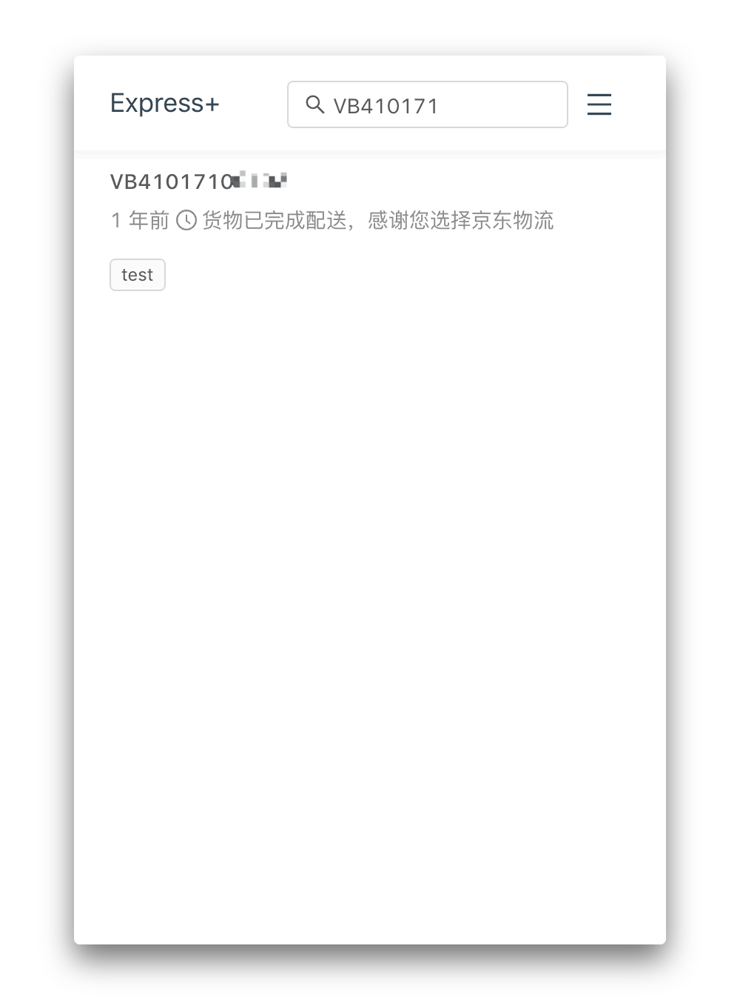
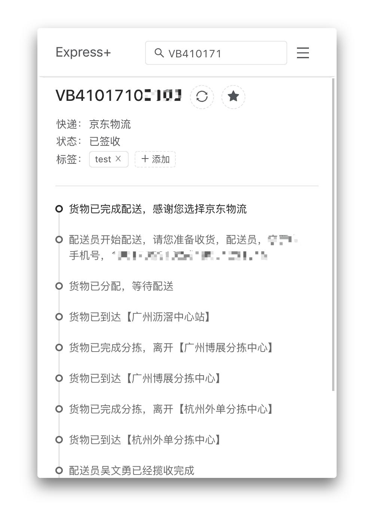
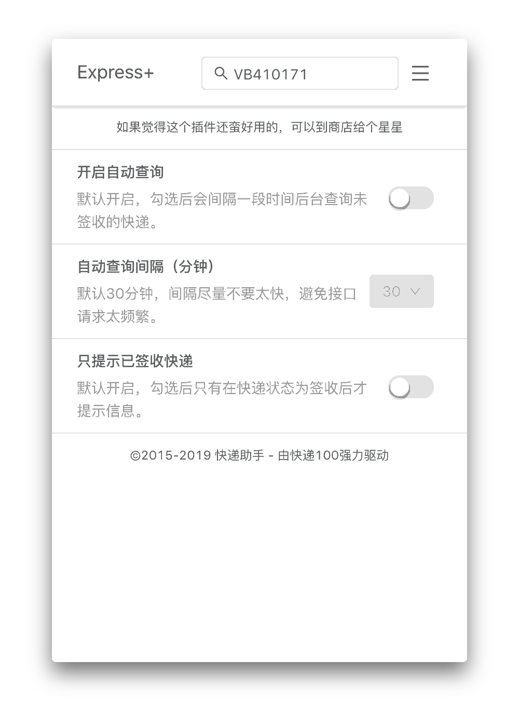
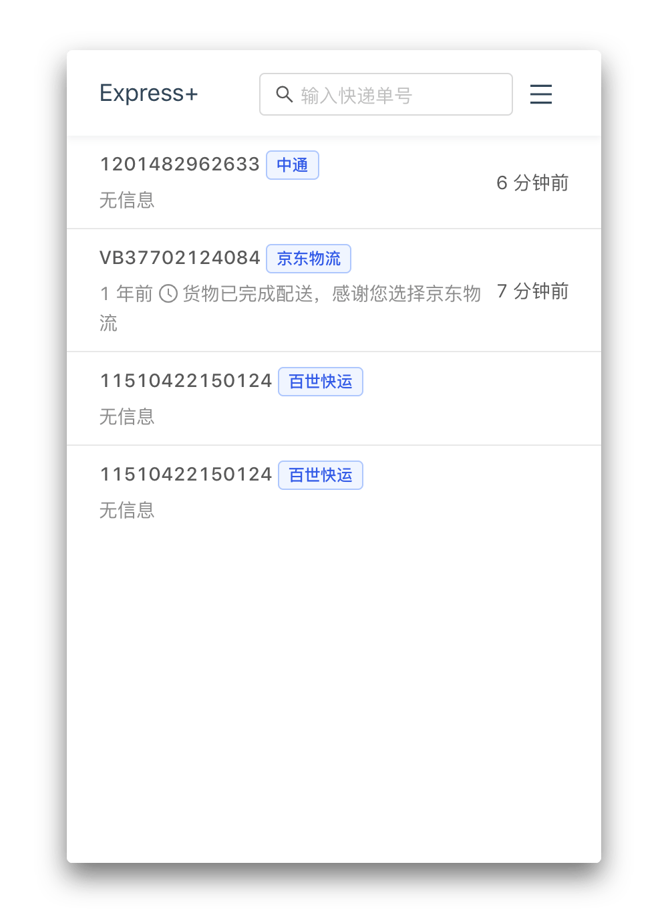
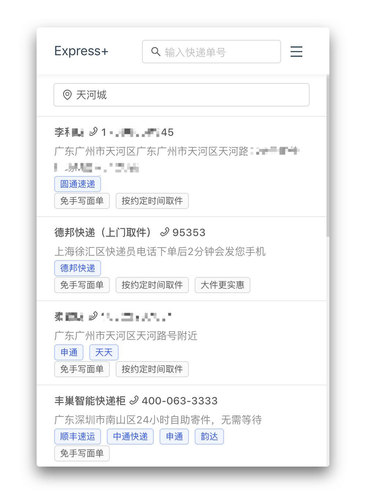

# 快递助手(Express+)


[](https://github.com/xojs/xo)
[][cws]
[][cws]
[][cws]

## What is this?

本项目使用 `create-react-app` 创建，最初目的是使用 `react-scripts` 来处理打包问题。<br>
实际上，我需要在chrome的插件上访问资源，原有的功能无法实现这一点，需要自定义 webpack 配置打包。<br>
在最后使用 webpack 的参数将文件写到磁盘，而不是通过 http 请求。<br>
之前使用 vue 写到半路又转 react 纯属蛋疼，顺便用下 antd 和 hooks。再顺便尝试维护一个多端的项目如何。

在原有的结构目录下来定义配置，设置也尽量使用 CRA 的原有设置。

- `babel-preset-react-app` - Babel配置，而不自己导入 `@babel/env` 等
- ~~`eslint-config-react-app` - eslint配置，基础中加入 prettier~~
- `react-dev-utils` - 工具库，一些修改的在 `utils` 文件夹。比如 `webpackHotDevClient.js` 文件中，SockJS连接的 `webpack-dev-server` 地址无法自定义
- `react-dev-utils/InterpolateHtmlPlugin` - 替换 html 中的自定义参数，比如 `%PUBLIC_URL%`，需要安装 `html-webpack-plugin@next`，`InterpolateHtmlPlugin` 没有兼容3.x。
- `react-error-overlay` - 在 `webpackHotDevClient` 中使用，在发生错误的时候直接在 react 页面中显示，默认是添加了 `static/js/bundle.js` 的侦听

其它相关库

- `dayjs` 没有使用有关时间日期的组件，所以不用加载 `moment`
- `ky` 反正也不用支持低版本浏览器，直接使用 `ky` 比 `axios` 什么的小多了
- `immer` 用来做数据的脏检查更新
- ~~`html-webpack-harddisk-plugin` `html-webpack-plugin` 在 devServer 下是不会生成 html 文件到 publicPath 的，可插件加载的时候需要 html 文件，不能使用 http。~~
- ~~`write-file-webpack-plugin` 上面那个只把 html 写入到磁盘中，需要全部文件用这个，比如 `copy-webpack-plugin` 在 3.x 后已经不会在 devServer 下写入磁盘~~
- `webextension-polyfill` 统一 Chrome 和 Firefox 的请求，并且让 API 支持 Promise，方便用 `async/await`。
- `@ant-design/icons` 为了不全部打包图标文件，在 webpack 配置将图标路径指向到 `icons.js`，小了500KB
- `lodash.debounce` 避免在输入快递单的时候多次请求接口

## Features

- 自动识别单号
- 自动查询更新信息
- 桌面提醒
- 查询记录
- 寄快递，查询附近投递方式

## Screenshots

<div>
  
  
  
  
  
  
</div>

## Install

[][cws]

## Questions

### 快递选择页面只有20多个，快递类型支持哪些？

快递选择页面只是目前收集有中文的展示，并不是只支持那些。插件使用的快递100的接口 ，那边支持的就支持，不可避免会出现识别错误的情况（或者单号过期），这个时候可以自行选择快递。不过在日常使用中我并不需要太多快递类型，如果遇到需要增加的提交 Issue 或者欢迎 PR。

### 为什么顺丰快递查询时好时坏？

~~顺丰官网更新后加了腾讯的[验证码](https://cloud.tencent.com/product/captcha)判断，导致无法直接调用。目前也不知道kuaidi100跟顺丰是否有谈合作，或者自行解析验证码问题。目前添加了另外一个查询接口来支持顺丰快递。~~ <br>
kuaidi100接口添加了phone参数来针对顺丰的查询，需要在查询的时候输入寄/收件人联系方式后4位来作为验证码。查询顺丰时会弹出窗口，或者可以点击验证码编辑按钮重新输入。

### 旧数据迁移或丢失问题 (0.1.12)

升级的判断出现了问题，所以可能有人的数据并没有转换到新的储存方式，旧的数据储存在 `localStorage`

1. 点击图标打开
2. 右键点击 `检查(inspect)`
3. 复制下面的代码到 Console 回车执行
4. 重新打开

```js
const oldData = window.localStorage.getItem('ngStorage-marks');
if (oldData) {
  const list = JSON.parse(oldData)
  const favorites = list.map(item => {
    return {
      postId: item.id,
      type: item.com,
      tags: item.tags,
      latestMessage: {
        time: item.time,
        context: item.text
      },
      state: item.check ? '3' : '0'
    };
  });
  chrome.storage.local.set({favorites});
}
window.localStorage.removeItem('ngStorage-marks');
```

## License

MIT, [License](LICENSE)

[cws]: https://chrome.google.com/webstore/detail/hghlokkgbicmblinhepcibacaiegldeg "Chrome Web Store"
[amo]: https://addons.mozilla.org/en-US/firefox/addon/express-plus/ "Firefox Add-ons"
