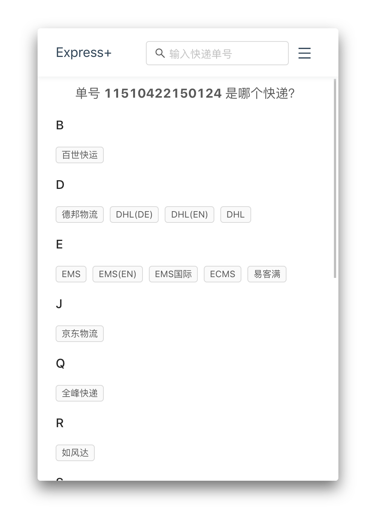

  

快递助手，轻松快捷的管理你的快递

[][cws]
[][cws]
[][cws]

## What is this?

- 换用 `@yme/webpack-config` 来打包
- `dayjs` 没有使用有关时间日期的组件，所以不用加载 `moment`
- `ky` 反正也不用支持低版本浏览器，比 `axios` 什么的小多了
- `webextension-polyfill` 统一 Chrome 和 Firefox 的请求，并且让 API 支持 Promise，方便用 `async/await`。
- `antd` 4+，已经整理出 icons 资源
- `emotion` 处理样式, css in js
- `dexie` 处理数据 IndexedDB
- `swr` 处理全部请求，转到 background 进程处理

## Highlights

- 自动识别单号
- 自动查询更新信息
- 桌面提醒
- 查询记录
- 寄快递，查询附近投递方式

## Screenshots

  
  
  
  
  
  

## Install

[][cws]

或者本地编译:

1. clone 这个项目 `git clone https://github.com/minosss/express-plus.git`
2. 安装依赖 `npm install` 或者 `yarn install`
3. 复制一份 `.env.example` 命名为 `.env` 并填入申请的密钥
4. 编译 `npm build` 或者 `yarn build`
5. Chrome 打开 `chrome://extensions/` 加载未打包应用 `Load unpacked`

## FAQs

### 查询返回的查无结果

快递 100 跟 baidu 页面的接口都进行了安全认证的加强。比如两边都加了需要 cookie 才可以请求，100的验证就更加严厉了，非法请求后可能会在短时间内封掉 IP。不过呢，毕竟这是插件... 
`WWWID` 使用 `Session` 储存，撇开有接口请求或者其它操作大概 20 分钟过期的样子，接口请求会不会刷新过期时间有待验证（感觉是不会） 
目前只能在 bg 使用 iframe 来获取 session，不过每 20 分钟就会过期，在后台更新或者打开窗口时再判断是否需要刷新一次页面。不过希望可以有更好的办法，用 iframe 感觉毕竟笨。

1. ~~请求前最好先访问首页获取 cookie 先，https://www.kuaidi100.com~~ 会过期
2. 不保证短时间内请求多个快递又被封掉（比如回返回随机数据就是出问题了）
3. baidu 也相同（不过 100 始终返回 200 也导致了没有使用 baidu 的接口）

### 地图定位（寄快递）

定位是使用 H5 的定位获取经纬度数据，然后用接口来获取附近的投递方式。如果定位失败可以输入关键字来搜索地址（高德的输入提示）进行经纬度的获取。目前只是申请了个人开发者并没有认证也没有购买请求配额，所以每天的关键字搜索是只有 2000 的。

### 快递选择页面只有 20 多个，快递类型支持哪些？

快递选择页面只是目前收集有中文的展示，并不是只支持那些。插件使用的快递 100 的接口 ，那边支持的就支持，不可避免会出现识别错误的情况（或者单号过期），这个时候可以自行选择快递。不过在日常使用中我并不需要太多快递类型，如果遇到需要增加的提交 Issue 或者欢迎 PR。

### 为什么顺丰快递查询时好时坏？

~~顺丰官网更新后加了腾讯的[验证码](https://cloud.tencent.com/product/captcha)判断，导致无法直接调用。目前也不知道 kuaidi100 跟顺丰是否有谈合作，或者自行解析验证码问题。目前添加了另外一个查询接口来支持顺丰快递。~~  
kuaidi100 接口添加了 phone 参数来针对顺丰的查询，需要在查询的时候输入寄/收件人联系方式后 4 位来作为验证码。查询顺丰时会弹出窗口，或者可以点击验证码编辑按钮重新输入。

### 京东物流单号格式

有两种格式一种是已订单号为货运单号，虽然可以识别成功。然而并不能查询到数据，在[官网](http://www.jdwl.com)查询也需要登录帐号才可以。另外一种已 `VB/VE` 之类的开头的则还可以直接查询到数据。

## License

MIT, [License](LICENSE)

[cws]: https://chrome.google.com/webstore/detail/hghlokkgbicmblinhepcibacaiegldeg 'Chrome Web Store'
[amo]: https://addons.mozilla.org/en-US/firefox/addon/express-plus/ 'Firefox Add-ons'
