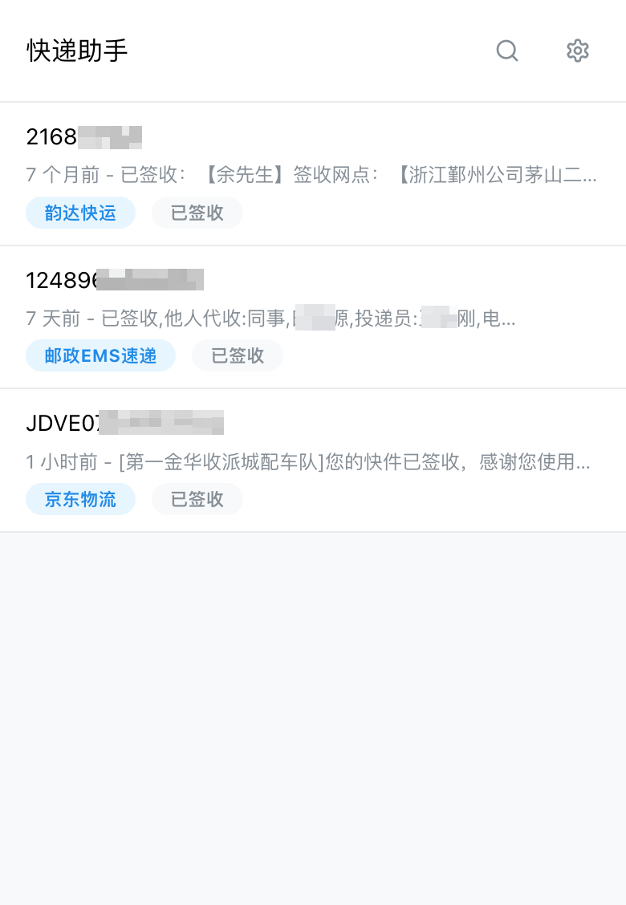
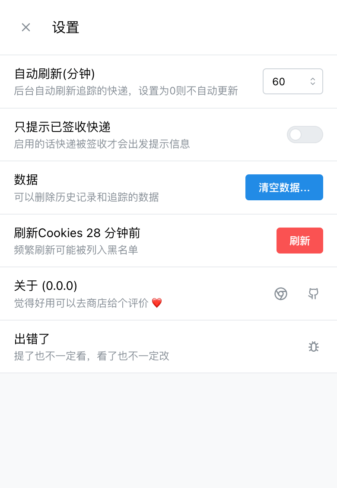
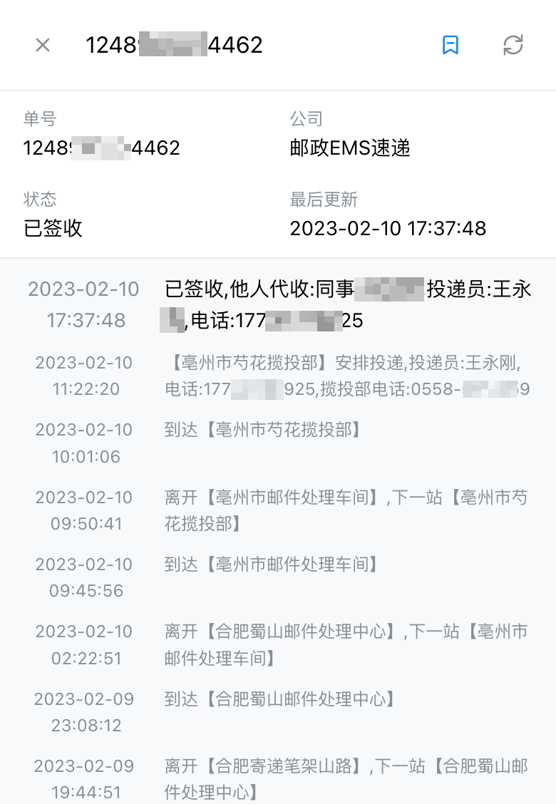

# 快递助手

新版的使用了 `chrome.offscreen`, 必需是 **Chrome 109+** 以上版本才支持

### 功能

- 自动识别单号
- 自动查询更新信息
- 桌面提醒
- 查询记录
- 标签管理

### 界面

### 安装

- Chrome: WebStore
- ~~Firefox: Add-ons~~ 还不支持 manifest V3

### 感谢

- React
- Mantine
- Parcel
- Lucide

---
MIT
